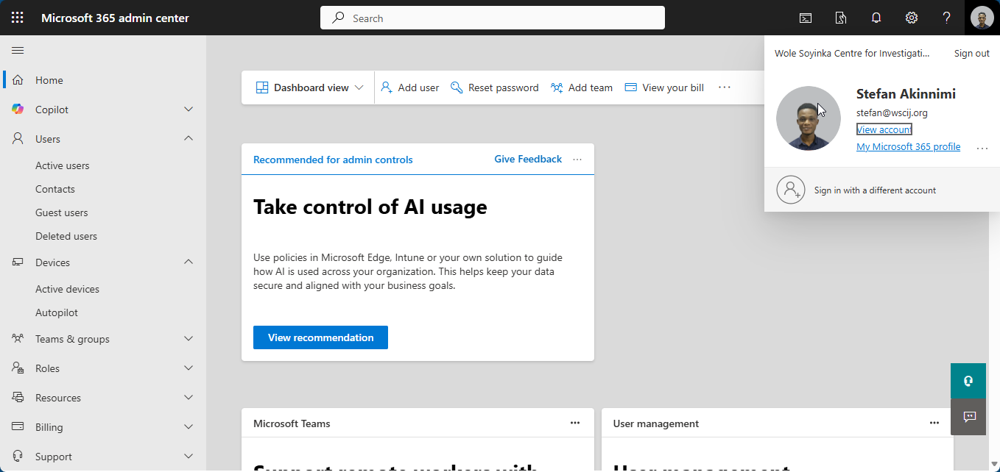
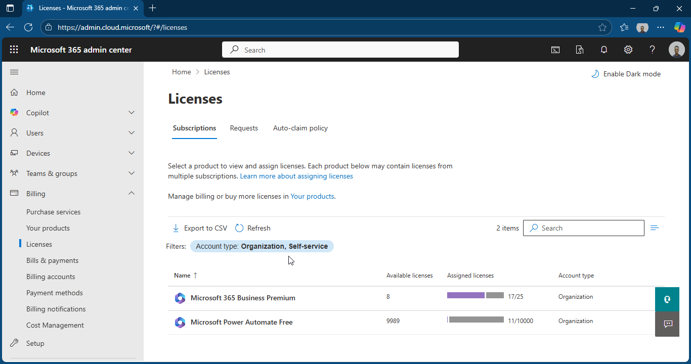
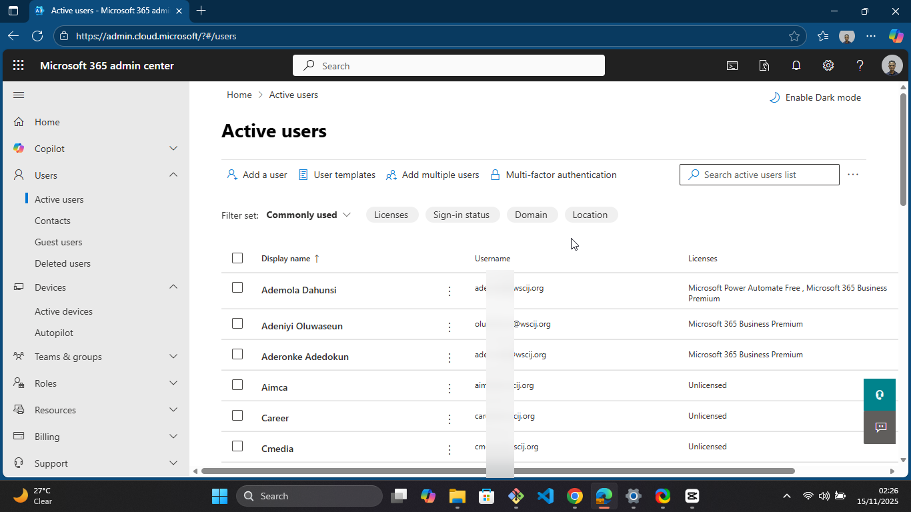
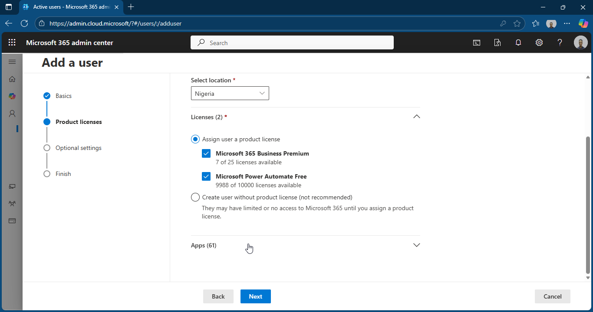
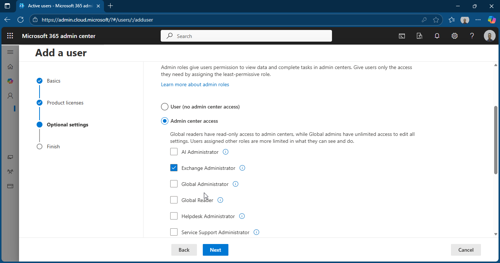
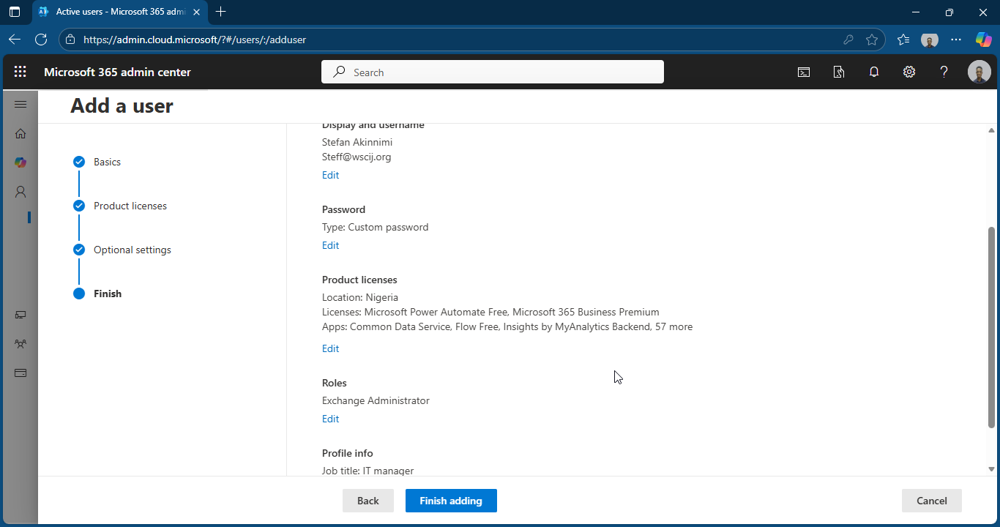

# 📁 Folder: 01-Admin-Center

This folder contains screenshots for **Microsoft 365 Admin Center** during the WSCIJ project.

| Screenshot | Description |
|-----------|-------------|
|  | Shows the Microsoft 365 Admin Center home screen after tenant setup. Highlights service health, user metrics, and licenses. |
|  | Displays all assigned licenses and subscription types for Business Premium users. |
|      | **Full User Creation Workflow in Microsoft 365 Admin Center:**  1️⃣ User List – shows all existing users. 2️⃣ Add User – form to fill in user names and initial password. 3️⃣ Set Password – confirm password settings. 4️⃣ Assign License – choose the appropriate Business Premium license. 5️⃣ Admin Role & Review – select admin or standard user and complete setup. |

--

## Purpose of this folder

- Validates initial Microsoft 365 tenant setup  
- Shows monitoring and license management capabilities  
- Demonstrates administrative oversight and reporting

