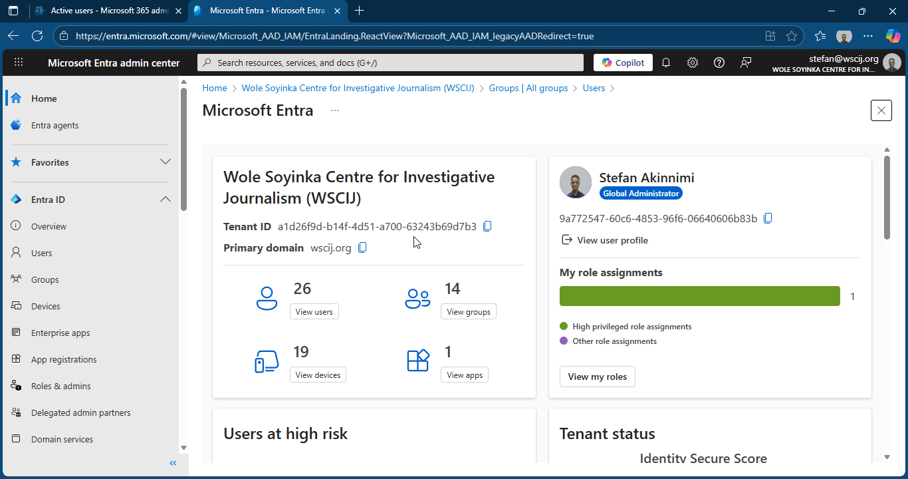
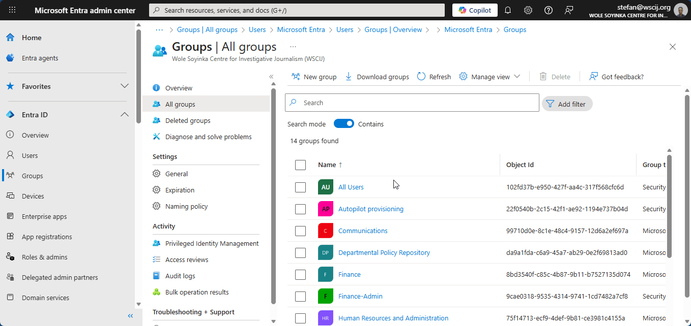
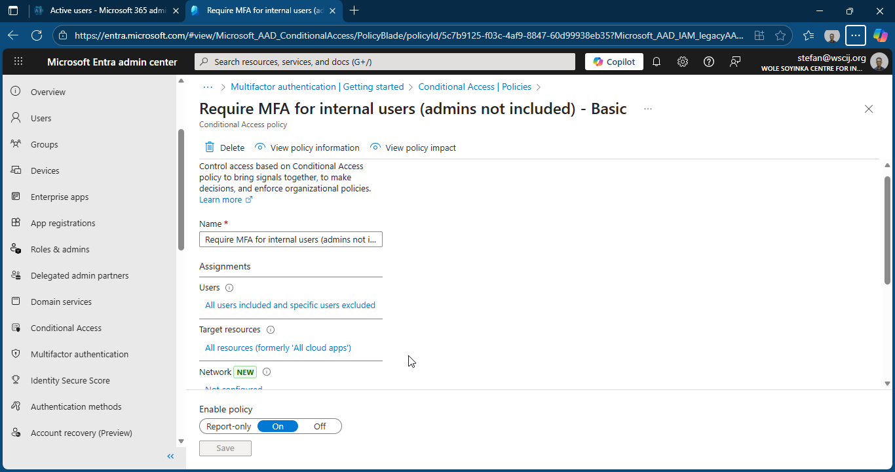
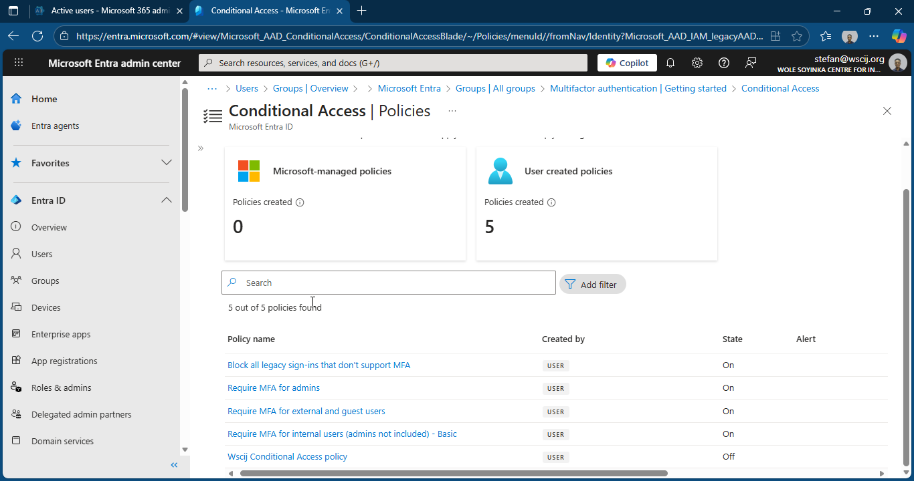

# 📁 Folder: 02-Entra-ID

This folder contains screenshots for **Entra ID (Azure AD)** configuration.

| Screenshot | Description |
|-----------|-------------|
|  | Overview of WSCIJ Entra Dashboard |
|  | Shows users and groups creation, including program-specific groups. |
|  | Demonstrates MFA setup for staff accounts. |
|  | Displays conditional access policies applied to secure devices. |

---

## Purpose of this folder

- Demonstrates identity and access management improvements  
- Shows MFA and conditional access implementation  
- Highlights tenant security governance

