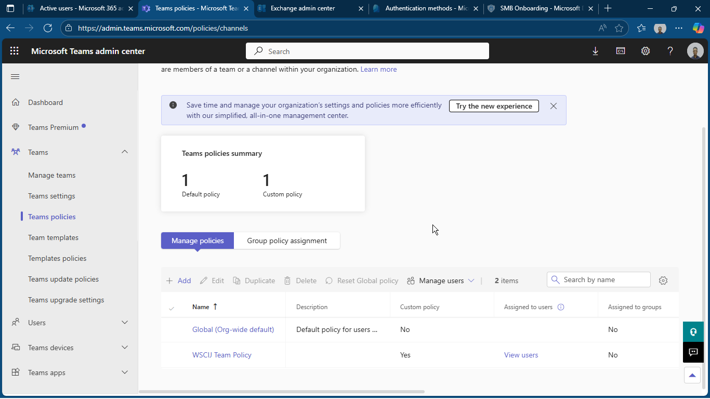

# 📁 Folder: 04-Teams

This folder contains screenshots for **Microsoft Teams** configuration and governance.

| Screenshot | Description |
|-----------|-------------|
|  | Displays Teams policies applied to staff for meetings and chat. |
| [teams-apps.png](teams-apps.png) | Shows allowed and blocked Teams apps per group. |

---

## Purpose of this folder

- Validates Teams governance  
- Shows app permission and policy management  
- Demonstrates collaboration improvements

