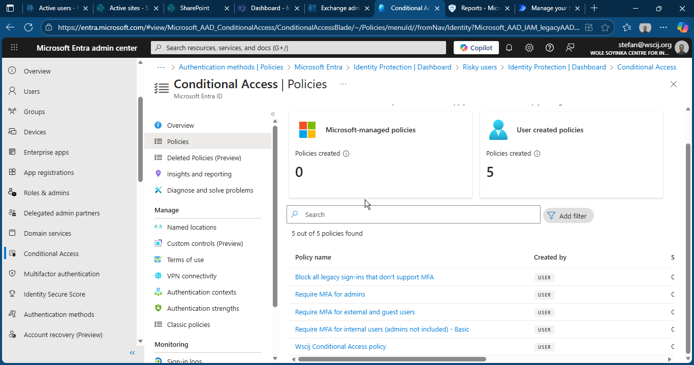
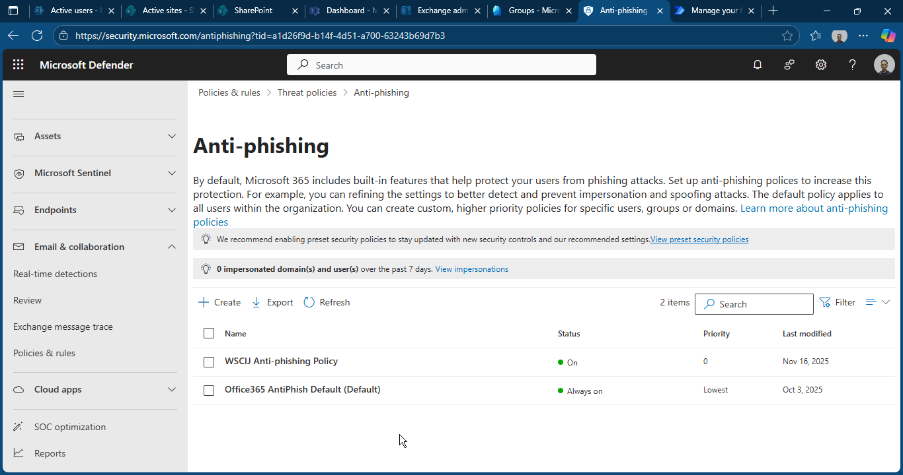
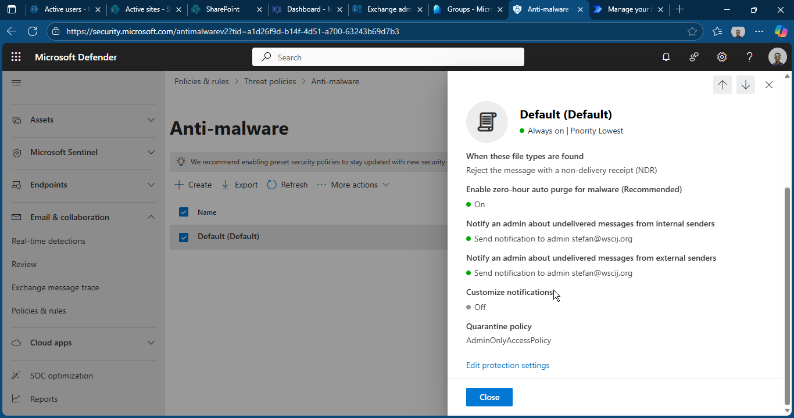
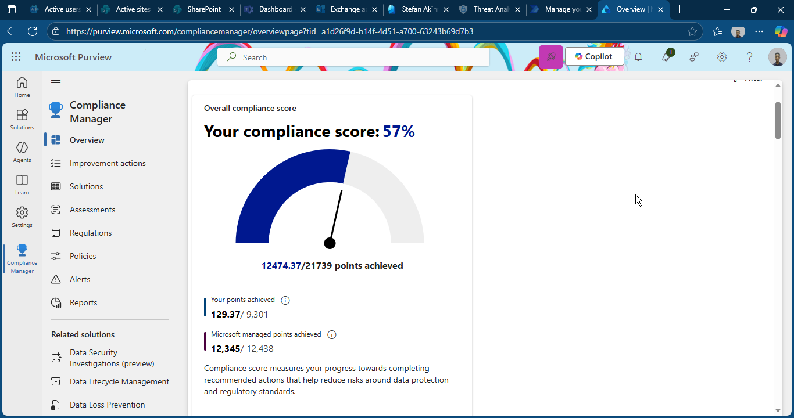

# 📁 Folder: 06-Security

# 🔐 Microsoft 365 Security & Compliance — Screenshot Documentation

This folder contains evidence of the baseline security posture for WSCIJ’s Microsoft 365 environment.  
All screenshots are organised in a table format for easy viewing and clear documentation.

---

## 📸 Security Screenshot Table

| Category | Screenshot | Description |
|---------|------------|-------------|
| **Secure Score (Baseline)** |  | Initial Microsoft Secure Score of **40%** showing the organisation’s starting security posture before any optimization. Future comparison (“After”) will be added later. |
| **Identity Security (Entra ID Protection)** |  | Displays risky users, risky sign-ins, and risk detections — used to assess identity threats before applying policies. |
| **Conditional Access Policies** |  | Shows existing Conditional Access (CA) policies. Will be updated after implementing MFA, compliant device, and admin protection policies. |
| **Defender for Office 365 — Anti-Phishing** |  | Shows baseline anti-phishing configuration before optimisation. |
| **Exchange Online Threat Policies (Anti-Spam/Malware)** |  | Current email protection posture including anti-malware, anti-spam, and safe attachments policies. |
| **Purview (Compliance Center) Dashboard** |  | Shows the organization’s compliance posture including data classification, auditing, and DLP readiness. |

---

# 📈 **Coming Soon — Post-Optimization Screenshots**

These will be added after improvements are complete:

- ✔️ Secure Score “After”  
- ✔️ MFA enforced for all users  
- ✔️ Conditional Access fully implemented  
- ✔️ Improved email security & anti-phishing  
- ✔️ Defender XDR alerts reduced  
- ✔️ Compliance (Purview) configuration updates  

---

# 📝 Notes

This documentation is part of the **WSCIJ Microsoft 365 Digital Transformation & Security Hardening Project**.

It provides verifiable evidence of work in:

- Microsoft Secure Score  
- Entra ID Identity Protection  
- Conditional Access  
- MFA Enforcement  
- Exchange Online Protection  
- Defender XDR  
- Email & Identity Security  

---
