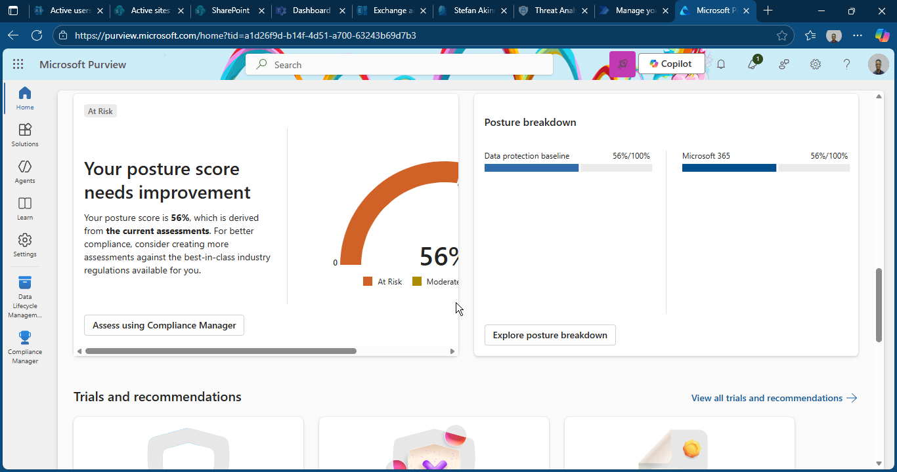
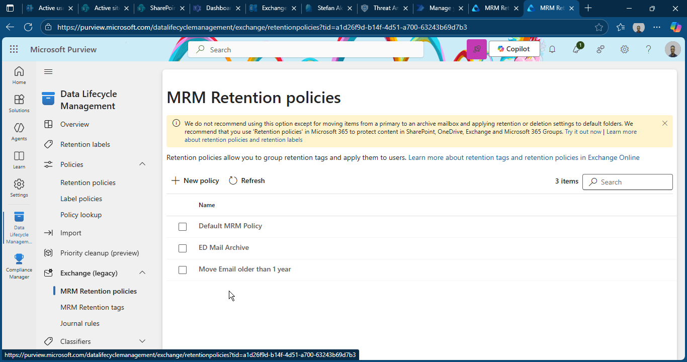

# 📂 Microsoft Purview – Compliance & Data Lifecycle Management

This folder contains all screenshots and documentation related to **Microsoft Purview Compliance Center**, including retention policies, retention labels, audit logs, and governance features deployed for the WSCIJ Microsoft 365 environment.

Purview ensures that organisational data is governed, retained, and protected according to compliance standards and business needs.

---

## 📌 Contents

| Area | Screenshot | Description |
|------|------------|-------------|
| **1. Purview Home Dashboard** |  | Overview of the organisation’s compliance posture, alerts, and data lifecycle management tools. |
| **2. Retention Policy – Email Auto-Archive (1 Year)** |  | Shows the retention policy created to automatically archive emails older than **1 year** to reduce mailbox size and optimise storage. |
<!--| **3. Retention Label – Email Lifecycle Tag** |  | Custom retention label used for categorising content that requires automatic archiving or long-term retention. |
<!--| **5. Compliance Search (Optional)** |  | Used for organisation-wide content queries when validating retention, archiving, or data management rules. |
| **6. Audit Logs (Optional)** |  | Captures administrative and user acti-->

---

## 📝 **1. Retention Policy – Email Auto-Archive (1 Year)**

The retention policy automatically moves emails older than **365 days** into the **Archive Mailbox**, providing:

- Reduced primary mailbox size  
- Improved Outlook performance  
- Long-term mailbox compliance  
- Better data governance  
- Reduced risk of accidental deletion  

This is ideal for organisations with storage concerns or heavy email usage.
